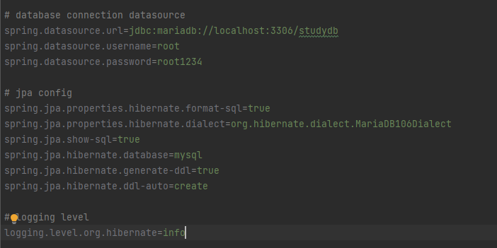
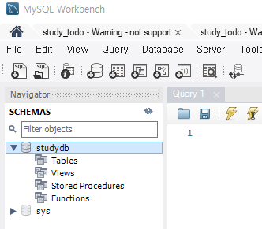
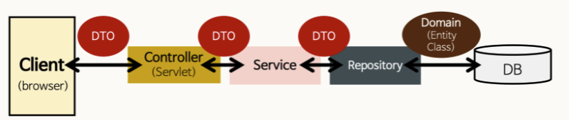
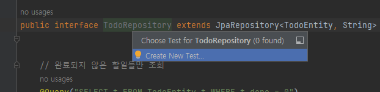
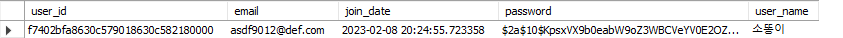

# 순서

복습 날짜 : 2023-02-04

## 기본 설정 + 데이터베이스 연결
1. https://start.spring.io/ 에서 프로젝트 다운로드

   (Dependencies : Spring Web, Lombok, Spring Boot Dev Tools, Thymeleaf, Spring Data JPA, MariaDB Driver, Validation)
2. GitHub 연동 후 Help.md -> README.md 파일명 변경
3. .gitignore 에서 README.md 써있는 줄 지우기
4. StudyTodoApplication.java (메인) 톰캣 실행 -> 데이터베이스 연결 안해서 오류 발생
5. application.properties 데이터베이스 연결 (MySQL Workbench 에서 스키마 존재 해야 함 - studydb)


6. 톰캣 재실행 -> 오류 X
7. 설정 -> 빌드,실행,배포 -> 컴파일러 : 프로젝트 자동 빌드 [체크]
8. 설정 -> 고급설정 -> 개발된 애플리케이션이 현재 실행중인 경우에도 auto-make 가 시작되도록 허용 [체크]

## 서버 연결 확인 설정
1. src/main/java/com/example/study_todo/HealthCheckController.java 생성 및 작성
2. 톰캣 실행 시 server is running... 뜨는지 확인 (http://localhost:8080)

## Entity, Repository, Service, Controller 작성


### Todo

- Entity 
: Domain

1. src/main/java/com/example/study_todo/entity/TodoEntity.java 생성 및 작성


- Repository
: Entity 에 의해 생성된 DB 에 접근하는 메서드들을 사용하기 위한 인터페이스

2. src/main/java/com/example/study_todo/repository/TodoRepository.java (interface) 생성 및 작성
3. Test 파일 생성 = repository 에서 Ctrl + Shift + t 로 테스트파일 생성 (TodoRepositoryTest.java)


- Service
: 비즈니스 로직을 수행하고 DB에 접근하는 DAO 를 이용해서 결과값을 받아옴 (중간처리) (DAO - Repository(JPA))

4. src/main/java/com/example/study_todo/service/TodoService.java 생성 및 작성

- DTO
: 

-> TodoService.java 수정하면서 DTO 파일 생성

5. src/main/java/com/example/study_todo/dto/response/TodoListResponseDTO.java 생성 및 작성
6. src/main/java/com/example/study_todo/dto/response/TodoDetailResponseDTO.java 생성 및 작성
7. src/main/java/com/example/study_todo/dto/request/TodoCreateRequestDTO.java 생성 및 작성
8. src/main/java/com/example/study_todo/dto/request/TodoModifyRequestDTO.java 생성 및 작성
9. Test 파일 생성 = repository 에서 Ctrl + Shift + t 로 테스트파일 생성 (TodoServiceTest.java)

- Controller
: 사용자의 요청을 처리한 뒤 지정된 뷰에 모델 객체를 넘겨주는 역할. 
  즉, 사용자의 요청이 진입하는 지점, 요청에 따라 어떤 처리를 할지 결정을 Service 에게 넘겨줌. 그 후 Service 에서 실질적으로 처리한 내용을 view 에게 넘겨줌 

10. src/main/java/com/example/study_todo/controller/TodoApiController.java 생성 및 작성
11. PostMan 에서 API 요청하며 Test

### User

- Entity
  : Domain

1. src/main/java/com/example/study_todo/entity/UserEntity.java 생성 및 작성

- Repository
  : Entity 에 의해 생성된 DB 에 접근하는 메서드들을 사용하기 위한 인터페이스

2. src/main/java/com/example/study_todo/repository/UserRepository.java (interface) 생성 및 작성
3. Test 파일 생성 = repository 에서 Ctrl + Shift + t 로 테스트파일 생성 (UserRepositoryTest.java)

- Service
  : 비즈니스 로직을 수행하고 DB에 접근하는 DAO 를 이용해서 결과값을 받아옴 (중간처리) (DAO - Repository(JPA))

4. src/main/java/com/example/study_todo/service/UserService.java 생성 및 작성

- DTO
  : 

-> UserService.java 수정하면서 DTO 파일 생성

5. src/main/java/com/example/study_todo/dto/response/UserSignUpResponseDTO.java 생성 및 작성
6. src/main/java/com/example/study_todo/dto/request/UserSignUpRequestDTO.java 생성 및 작성
7. Test 파일 생성 = repository 에서 Ctrl + Shift + t 로 테스트파일 생성 (TodoServiceTest.java)

- 패스워드 인코딩
  : 

8. build.gradle 파일에 '스프링 시큐리티 모듈', 'json web token 라이브러리' 추가 후 build

```
  // 스프링 시큐리티 모듈
  implementation 'org.springframework.boot:spring-boot-starter-security'
  
  // json web token 라이브러리
  implementation 'io.jsonwebtoken:jjwt-api:0.11.2'
  implementation 'io.jsonwebtoken:jjwt-impl:0.11.2'
  implementation 'io.jsonwebtoken:jjwt-jackson:0.11.2' 
```

9. src/main/java/com/example/study_todo/config/WebSecurityConfig.java 생성 및 작성
10. 패스워드 인코딩 클래스에 맞게 UserService.java, UserServiceTest.java 파일 수정


- Controller
  : 사용자의 요청을 처리한 뒤 지정된 뷰에 모델 객체를 넘겨주는 역할.
  즉, 사용자의 요청이 진입하는 지점, 요청에 따라 어떤 처리를 할지 결정을 Service 에게 넘겨줌. 그 후 Service 에서 실질적으로 처리한 내용을 view 에게 넘겨줌

11. src/main/java/com/example/study_todo/controller/UserApiController.java 생성 및 작성


- 사용자 정의 예외 클래스

12. src/main/java/com/example/study_todo/DuplicatedEmailException.java, NoRegisteredArgumentsException.java 생성 및 작성
13. 사용자 정의 예외 클래스에 맞게 UserService.java 파일 수정

- security builder

14. security builder 설정 (WebSecurityConfig.java)
15. 이메일 중복 확인을 위해 UserService.java, UserApiController.java 파일 수정


16. 로그인 검증을 위해 UserService.java, UserServiceTest.java 파일 수정


- Token

17. src/main/java/com/example/study_todo/security/TokenProvider.java 생성 및 작성
18. src/main/java/com/example/study_todo/dto/response/LoginResponseDTO.java 생성 및 작성
19. UserService.java 수정 
20. src/main/java/com/example/study_todo/dto/request/LoginRequestDTO.java 생성 및 작성
21. UserApiController.java 수정
22. UserServiceTest.java 수정

- 연관관계 매핑

23. TodoEntity.java 에 연관관계 매핑
24. TodoRepository.java 에 특정 회원(User) 의 할일 목록 조회 추가 (연관관계 이용)
25. TodoRepositoryTest.java 수정 


---
## 필기
- Health Check : 서버 상태 확인
- internalServerError() : Internal Server Error 가 나오는 경우는 에러 코드로 500번대 에러 메세지가 나오는 경우 (서버의 문제)
- HttpServletRequest : PUT 인지, PATCH 인지 요청정보를 알 수있음

### annotation
- @RestController: JSON 으로 데이터를 주고받음을 선언 
- @Slf4j: 로깅 추상화 라이브러리
- @Getter, @Setter : 접근자/설정자 자동 생성 
- @ToString : toString() 메소드 자동 생성 
- @NoArgsConstructor : 생성자 자동 생성 - 파라미터가 없는 기본 생성자 
- @AllArgsConstructor : 생성자 자동 생성 - 모든 필드 값을 파라미터로 받는 생성자 
- @RequiredArgsConstructor : 초기화 되지 않은 final 필드나, @NonNull 이 붙은 필드에 대해 생성자를 생성해줌
- @EqualsAndHashCode(of = "todoId") : equals, hashCode 메소드 자동 생성 
  (equals : 두 객체의 내용이 같은지, 동등성을 비교하는 연산자 / hashCode : 두 객체가 같은 객체인지, 동일성을 비교하는 연산자)
- @Builder : 빌드 패턴 자동 생성
- @Entity : 데이터베이스 테이블
- @Table(name = "tbl_todo")       // 테이블 명칭 지정 (tbl_todo)
- @Id : 테이블 상의 Primary Key 
- @GeneratedValue(generator = "system-uuid") : 랜덤으로 생성
- @Validated : 데이터 유효성 검증
- @RequestBody : HttpRequest 의 본문 RequestBody 의 내용을 자바 객체로 매핑 
- @BindingResult : ModelAttribute 을 이용하여 매개변수를 Bean 에 binding 할 때, 발생한 오류 정보를 받기 위해 선언해야 하는 어노테이션
- @PathVariable("id") : id를 경로에서 읽음
- @EnableWebSecurity : 사용자 정의 보안 정의 클래스 활성화